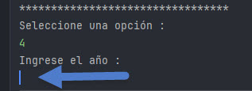

# LiterAlura Challenge Java

## Challenge Backend de Alura

#### Buscador de libros consumiendo la API de la web [Gutendex](https://gutendex.com/) para obtener toda la información de los libros y posteriormente guardarlos en una base de datos de PosgrestSQL.

Ademas el consumo de los [lenguajes](https://juanmedina100.github.io/idiomas-iso-639-1-json/idiomas-639-1.json) para obtener su nombre de idioma partiendo de su código para poder enrriquecer aun mas la aplicación.

## Requesitos para descarga y uso de LiterAlura Challenge Java

    - Clonar o descargar el repositorio.
    - Instalar PostgreSQL (O usar Docker)
    - Configurar las variables de entorno.

## Variables de entorno

Crear un archivo en src/main/resources/ llamada : env.properties y agrega las siguientes varibles:

| VARIABLE | DESCRIPCIÓN                                                                                                                 |
|----------|-----------------------------------------------------------------------------------------------------------------------------|
| DB_HOST | Si se esta trabajando en un entorno local debe ser: localhost en caso de ser un servicor en linea debe ser: tu dirección IP |
| DB_PORT | Este es el puerto donde esta corriendo nuestra base de datos                                                                |
| DB_BOOKS | Este es el nombre de tu base de datos                                                                                       |
| USER_NAME | Este es el nombre de usuario para conectarnos a la base de datos                                                            |
| PASSWORD | Este es la contraseña de la base de datos                                                                                   |

# Aplicación

## Menú

#### A continuación el menú de la aplicaión en el cual se muestran los campos requeridos y los campos adicionales.

#### LiterAlura Challenge solicitado nos solicita 6 funcionalidades en la aplicación que son las que estan marcadas con color azul + la opción 0 que es para cerrar la aplicación.
#### En este proyecto se han agregado 4 opción más con el fin de demostrar los conocimientos adquirido en clases de Alura.

## ¿Como funciona esta aplicación?

### General:
#### Una vez configurada la aplicación correr la aplicación (dando clic en Run) lo cual nos cargara el menu principal

#### Nos solicitara que elijamos una opción de 1 al 9 o la opción 0 para salir.

#### Al presionar el numero 1 nos pedira el titulo del libro 

### 1 - Buscar libro por titulo
#### Esta opción buscara en la API de [Gutendex](https://gutendex.com/) para mostrarlo en panatalla y simultaneamente lo guardara en la base de datos previamente creada.

#### En esta opción hay dos tipos de respuesta 

#### - Libro encontrado

#### - libro no encontrado

### 2 - Listar libros registrados
#### Esta opción buscara en nuestra base de datos los autores que posteriormente fueron descargados en la opción 1

#### - Respuesta obtenida

### 3 - Listar autores registrados
#### Esta opción buscara en nuestra base de datos los libros que posteriormente fueron descargados en la opción 1, agregando un campo adicional y calculado a la consulta y ese campo es los años que vivio esa persona según la información de la API.

#### - Respuesta obtenida

### 4 - Listar autores vivos en determinado año
#### Esta opción buscara en nuestra base de datos los autores que posteriormente fueron descargados en la opción 1 y se encuentran vivos en el año proporcionado.
#### Al seleccionar la opción 4 nos pedira el año que deseamos consultar.

#### - Aca ingresamos el año

#### - Respuesta obtenida

### 5 - Listar libros por idioma
#### Esta opción buscara en nuestra base de datos los libros por idioma, es necesario colocar el cógigo del idioma segun el iso-639-1 que es de solo 2 letras, ejemplo es = Español, en = Ingles, bn = Bengalí, etc. 

#### Aca debes escribir el código del idioma

#### Los códigos y sus idiomas los puedes encontrar en el siguiente [enlace de idiomas](https://juanmedina100.github.io/idiomas-iso-639-1-json/idiomas-639-1.json).

#### - Respuesta obtenida

## Opción adicionales a lo solicitado en el Cchallenge

### 6 - Top 10 libros con mas descargas
#### - Respuesta obtenida

### 7 - Top 10 libros con menos descargas
#### - Respuesta obtenida

### 8 - Top 10 Autores con mas años
#### - Respuesta obtenida

### 9 - Top 10 Autores con menos años
#### - Respuesta obtenida

## Insignia 

